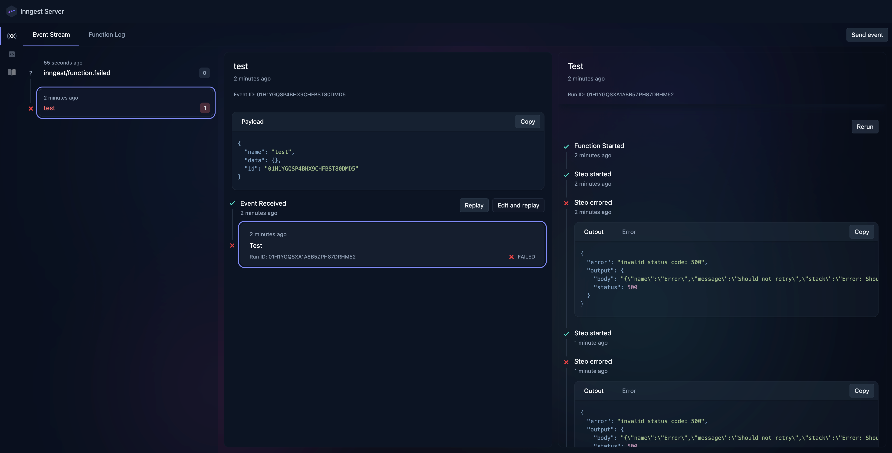

### Reproduction case

Inngest retries function steps when `NonRetriableError` was thrown inside the step.

1. Install dependencies

```sh
npm install
```

2. Start next and inngest servers

```sh
npm run dev
```

3. Send test event

```sh
curl -v -d '{"name":"test","data":{}}' http://localhost:8288/e/test
```

4. Open http://localhost:8288 and check event stream - the event is retried 3 times, while it should not:


